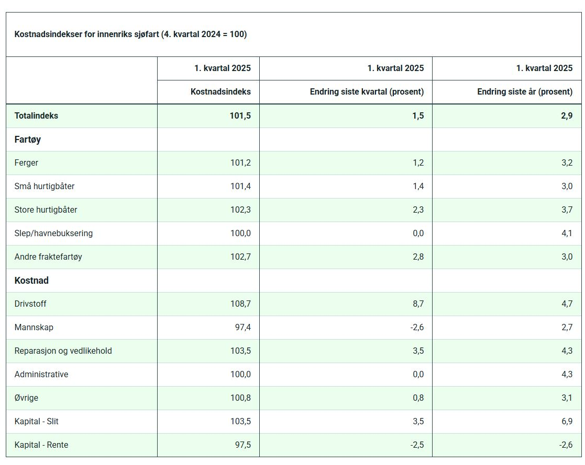

# SSB Prisstatistikk per måned for gjennomsnittlig månedspris autodiesel

Se [Tabell avgiftspliktig diesel](https://www.ssb.no/statbank/table/09654/tableViewLayout1/) 
for snittpris per måned for autodiesel; ikke marine gassoljer/bunkers.


Fila '09654_20250909-091411.xls' har data fra denne tabellen for 1986M08-2025M07. 

## API-kall
URL: https://data.ssb.no/api/v0/no/table/09654/

JSON-query(json-stat2) for 2024-2025:

```
{
  "query": [
    {
      "code": "PetroleumProd",
      "selection": {
        "filter": "item",
        "values": [
          "035"
        ]
      }
    },
    {
      "code": "Tid",
      "selection": {
        "filter": "item",
        "values": [
          "2024M01",
          "2024M02",
          "2024M03",
          "2024M04",
          "2024M05",
          "2024M06",
          "2024M07",
          "2024M08",
          "2024M09",
          "2024M10",
          "2024M11",
          "2024M12",
          "2025M01",
          "2025M02",
          "2025M03",
          "2025M04",
          "2025M05",
          "2025M06",
          "2025M07"
        ]
      }
    }
  ],
  "response": {
    "format": "json-stat2"
  }
}
```


PxWebApi 2.0 beta (for 2024-25): https://data.ssb.no/api/pxwebapi/v2-beta/tables/09654/data?lang=no&valueCodes[PetroleumProd]=035&valueCodes[Tid]=2024M01,2024M02,2024M03,2024M04,2024M05,2024M06,2024M07,2024M08,2024M09,2024M10,2024M11,2024M12,2025M01,2025M02,2025M03,2025M04,2025M05,2025M06,2025M07&valueCodes[ContentsCode]=Priser

<details>
  <summary>Click to expand PxWebApi response (json-stat2):</summary>

```
{
  "version": "2.0",
  "class": "dataset",
  "label": "09654: Priser på drivstoff (kroner per liter), etter petroleumsprodukt og måned",
  "source": "Statistisk sentralbyrå",
  "updated": "2025-08-20T06:00:00Z",
  "role": {
    "time": [
      "Tid"
    ],
    "metric": [
      "ContentsCode"
    ]
  },
  "id": [
    "PetroleumProd",
    "ContentsCode",
    "Tid"
  ],
  "size": [1, 1, 19],
  "dimension": {
    "PetroleumProd": {
      "label": "petroleumsprodukt",
      "category": {
        "index": {
          "035": 0
        },
        "label": {
          "035": "Avgiftspliktig diesel"
        }
      },
      "extension": {
        "elimination": false,
        "show": "value"
      }
    },
    "ContentsCode": {
      "label": "statistikkvariabel",
      "category": {
        "index": {
          "Priser": 0
        },
        "label": {
          "Priser": "Priser (kr per liter)"
        },
        "unit": {
          "Priser": {
            "base": "kr per liter",
            "decimals": 2
          }
        }
      },
      "extension": {
        "elimination": false,
        "refperiod": {
          "Priser": "01.01.-31.12."
        },
        "show": "value",
        "measuringType": {
          "Priser": "Average"
        },
        "priceType": {
          "Priser": "NotApplicable"
        },
        "adjustment": {
          "Priser": "None"
        }
      }
    },
    "Tid": {
      "label": "måned",
      "category": {
        "index": {
          "2024M01": 0,
          "2024M02": 1,
          "2024M03": 2,
          "2024M04": 3,
          "2024M05": 4,
          "2024M06": 5,
          "2024M07": 6,
          "2024M08": 7,
          "2024M09": 8,
          "2024M10": 9,
          "2024M11": 10,
          "2024M12": 11,
          "2025M01": 12,
          "2025M02": 13,
          "2025M03": 14,
          "2025M04": 15,
          "2025M05": 16,
          "2025M06": 17,
          "2025M07": 18
        },
        "label": {
          "2024M01": "2024M01",
          "2024M02": "2024M02",
          "2024M03": "2024M03",
          "2024M04": "2024M04",
          "2024M05": "2024M05",
          "2024M06": "2024M06",
          "2024M07": "2024M07",
          "2024M08": "2024M08",
          "2024M09": "2024M09",
          "2024M10": "2024M10",
          "2024M11": "2024M11",
          "2024M12": "2024M12",
          "2025M01": "2025M01",
          "2025M02": "2025M02",
          "2025M03": "2025M03",
          "2025M04": "2025M04",
          "2025M05": "2025M05",
          "2025M06": "2025M06",
          "2025M07": "2025M07"
        }
      },
      "extension": {
        "elimination": false,
        "show": "code"
      }
    }
  },
  "extension": {
    "px": {
      "infofile": "None",
      "tableid": "09654",
      "decimals": 2,
      "official-statistics": true,
      "aggregallowed": false,
      "copyright": false,
      "language": "no",
      "contents": "09654: Priser på drivstoff (kroner per liter),",
      "descriptiondefault": false,
      "heading": [
        "ContentsCode",
        "Tid"
      ],
      "stub": [
        "PetroleumProd"
      ],
      "matrix": "Priser",
      "subject-code": "ei",
      "subject-area": "Energi og industri"
    },
    "discontinued": null,
    "contact": [
      {
        "name": "Sigrun Kristoffersen",
        "organization": "Statistisk sentralbyrå",
        "phone": "409 02 313",
        "mail": "sek@ssb.no",
        "raw": "Sigrun Kristoffersen, Statistisk sentralbyrå# +47 409 02 313#sek@ssb.no"
      },
      {
        "name": "Ingunn Marie Verne Ruud",
        "organization": "Statistisk sentralbyrå",
        "phone": "489 96 563",
        "mail": "iev@ssb.no",
        "raw": "Ingunn Marie Verne Ruud, Statistisk sentralbyrå# +47 489 96 563#iev@ssb.no"
      }
    ]
  },
  "value": [20.1, 21.96, 21.05, 21.42, 21.66, 21.77, 21.04, 20.29, 20.27, 20.81, 21.15, 20.99, 21.43, 21.07, 20.43, 19.06, 19.17, 18.74, 20.69]
}
```
</details>

# Omsetningstall for petroleumsprodukter
Se [Sal av pretroleumsprodukt og flytande biodrivstoff](https://www.ssb.no/statbank/table/13615/tableViewLayout1/) 
for snittpris per måned for autodiesel; ikke marine gassoljer/bunkers.


## API kall

URL: https://data.ssb.no/api/v0/no/table/13615/
JSON-query:
```
{
  "query": [
    {
      "code": "Produkter",
      "selection": {
        "filter": "item",
        "values": [
          "01",
          "02a",
          "02b",
          "03",
          "04+05",
          "06",
          "07",
          "08",
          "09",
          "98"
        ]
      }
    },
    {
      "code": "NACE",
      "selection": {
        "filter": "item",
        "values": [
        "01-03",
          "50"
        ]
      }
    },
    {
      "code": "ContentsCode",
      "selection": {
        "filter": "item",
        "values": [
          "Petroleum"
        ]
      }
    }
  ],
  "response": {
    "format": "json-stat2"
  }
}
```

PxWebApi 2.0 beta (for 2020-24, Jorbruk, skogbruk, fiske samt sjøfart): https://data.ssb.no/api/pxwebapi/v2-beta/tables/13615/data?lang=no&valueCodes[Produkter]=01,02a,02b,03,04%2b05,06,07,08,09,98&valueCodes[NACE]=01-03,50&valueCodes[ContentsCode]=Petroleum&valueCodes[Tid]=2020,2021,2022,2023,2024


<details>
  <summary>Click to expand PxWebApi response (json-stat2):</summary>

```
{
  "version": "2.0",
  "class": "dataset",
  "label": "13615: Sal av petroleumsprodukt og flytande biodrivstoff, etter produkt, næring og år",
  "source": "Statistisk sentralbyrå",
  "updated": "2025-04-11T06:00:00Z",
  "note": [
    "Tal for produkta bensin, autodiesel, anleggsdiesel, marine gassoljer, lett fyringsolje og fyringsparafin for åra 2022-2024 vart retta 11.april 2025.",
    ". = Ikke mulig å oppgi tall. Tall finnes ikke på dette tidspunktet fordi kategorien ikke var i bruk da tallene ble samlet inn."
  ],
  "role": {
    "time": [
      "Tid"
    ],
    "metric": [
      "ContentsCode"
    ]
  },
  "id": [
    "Produkter",
    "NACE",
    "ContentsCode",
    "Tid"
  ],
  "size": [10, 2, 1, 5],
  "dimension": {
    "Produkter": {
      "label": "produkt",
      "category": {
        "index": {
          "01": 0,
          "02a": 1,
          "02b": 2,
          "03": 3,
          "04+05": 4,
          "06": 5,
          "07": 6,
          "08": 7,
          "09": 8,
          "98": 9
        },
        "label": {
          "01": "Bilbensin",
          "02a": "Autodiesel",
          "02b": "Anleggsdiesel",
          "03": "Marine gassoljer",
          "04+05": "Lett fyringsolje og fyringsparafin",
          "06": "Jetparafin",
          "07": "Tungdestillat og tungolje",
          "08": "Smøremiddel",
          "09": "LPG og LNG",
          "98": "Andre"
        }
      },
      "extension": {
        "elimination": false,
        "show": "value"
      },
      "link": {
        "describedby": [
          {
            "extension": {
              "Produkter": "urn:ssb:classification:klass:694"
            }
          }
        ]
      }
    },
    "NACE": {
      "label": "næring",
      "category": {
        "index": {
          "01-03": 0,
          "50": 1
        },
        "label": {
          "01-03": "Jordbruk, skogbruk og fiske",
          "50": "Sjøfart"
        }
      },
      "extension": {
        "elimination": false,
        "show": "value"
      },
      "link": {
        "describedby": [
          {
            "extension": {
              "NACE": "urn:ssb:classification:klass:6"
            }
          }
        ]
      }
    },
    "ContentsCode": {
      "label": "statistikkvariabel",
      "category": {
        "index": {
          "Petroleum": 0
        },
        "label": {
          "Petroleum": "Sal av petroleumsprodukt (inkl. iblanda bio)"
        },
        "unit": {
          "Petroleum": {
            "base": "1 000 liter",
            "decimals": 0
          }
        }
      },
      "extension": {
        "elimination": false,
        "refperiod": {
          "Petroleum": "Slutten av året"
        },
        "show": "value",
        "measuringType": {
          "Petroleum": "Flow"
        },
        "priceType": {
          "Petroleum": "NotApplicable"
        },
        "adjustment": {
          "Petroleum": "None"
        }
      }
    },
    "Tid": {
      "label": "år",
      "category": {
        "index": {
          "2020": 0,
          "2021": 1,
          "2022": 2,
          "2023": 3,
          "2024": 4
        },
        "label": {
          "2020": "2020",
          "2021": "2021",
          "2022": "2022",
          "2023": "2023",
          "2024": "2024"
        }
      },
      "extension": {
        "elimination": false,
        "show": "code"
      }
    }
  },
  "extension": {
    "px": {
      "infofile": "None",
      "tableid": "13615",
      "decimals": 0,
      "official-statistics": true,
      "aggregallowed": true,
      "copyright": false,
      "language": "no",
      "contents": "13615: Sal av petroleumsprodukt og flytande biodrivstoff,",
      "descriptiondefault": false,
      "heading": [
        "ContentsCode",
        "Tid"
      ],
      "stub": [
        "Produkter",
        "NACE"
      ],
      "matrix": "Petroleum",
      "subject-code": "ei",
      "subject-area": "Energi og industri"
    },
    "discontinued": null,
    "contact": [
      {
        "name": "Ingunn Marie Verne Ruud",
        "organization": "Statistisk sentralbyrå",
        "phone": "489 96 563",
        "mail": "iev@ssb.no",
        "raw": "Ingunn Marie Verne Ruud, Statistisk sentralbyrå# +47 489 96 563#iev@ssb.no"
      },
      {
        "name": "Sigrun Kristoffersen",
        "organization": "Statistisk sentralbyrå",
        "phone": "409 02 313",
        "mail": "sek@ssb.no",
        "raw": "Sigrun Kristoffersen, Statistisk sentralbyrå# +47 409 02 313#sek@ssb.no"
      }
    ]
  },
  "value": [6, 6, 25, 441, 381, 4752, 4932, 4514, 4728, 3275, 544, 460, 359, 1496, 1438, 34888, 35515, 33352, 34975, 32206, 21349, 21277, 20027, 33131, 35386, 22572, 21831, 19173, 29066, 21358, 19802, 27822, 8276, 253886, 186688, 335686, 348961, 387203, 534591, 411953, 152, 472, 379, 213, 129, 1891, 2167, 2011, 444, 336, null, null, null, null, null, null, null, null, null, null, null, null, null, null, null, 22995, 7712, null, null, null, 34, 33, 45, 1247, 1147, 905, 873, 626, 1919, 1811, null, null, null, 0, 0, null, 64, 0, null, null, 5, 9, 1, 1, null, null, null, null, null, null],
  "status": {
    "50": ".",
    "51": ".",
    "52": ".",
    "53": ".",
    "54": ".",
    "55": ".",
    "56": ".",
    "57": ".",
    "58": ".",
    "59": ".",
    "60": ".",
    "61": ".",
    "62": ".",
    "63": ".",
    "64": ".",
    "67": ".",
    "68": ".",
    "69": ".",
    "80": ".",
    "81": ".",
    "82": ".",
    "85": ".",
    "88": ".",
    "89": ".",
    "94": ".",
    "95": ".",
    "96": ".",
    "97": ".",
    "98": ".",
    "99": "."
  }
}
```
</details>

# Kostnadsindex for innenriks sjøfart
Se [tabell for relativ kostnadsutvikling per kvartal](https://www.ssb.no/transport-og-reiseliv/sjotransport/statistikk/kostnadsindeks-for-innenriks-sjofart)
og [kostnadsindeks for innenriks sjøfart-drivstoff](https://www.ssb.no/statbank/table/11585/tableViewLayout1/).


## API kall

URL: https://data.ssb.no/api/v0/no/table/11585/

JSON-query:
```
{
  "query": [
    {
      "code": "TotalDelindeks",
      "selection": {
        "filter": "item",
        "values": [
          "DRV"
        ]
      }
    }
  ],
  "response": {
    "format": "json-stat2"
  }
}
```
PxWebApi 2.0 beta: https://data.ssb.no/api/pxwebapi/v2-beta/tables/11585/data?lang=no&valueCodes[TotalDelindeks]=DRV&valueCodes[Tid]=2009K2,2009K3,2009K4,2010K1,2010K2,2010K3,2010K4,2011K1,2011K2,2011K3,2011K4,2012K1,2012K2,2012K3,2012K4,2013K1,2013K2,2013K3,2013K4,2014K1,2014K2,2014K3,2014K4,2015K1,2015K2,2015K3,2015K4,2016K1,2016K2,2016K3,2016K4,2017K1,2017K2,2017K3,2017K4,2018K1,2018K2,2018K3,2018K4,2019K1,2019K2,2019K3,2019K4,2020K1,2020K2,2020K3,2020K4,2021K1,2021K2,2021K3,2021K4,2022K1,2022K2,2022K3,2022K4,2023K1,2023K2,2023K3,2023K4,2024K1,2024K2,2024K3,2024K4,2025K1&valueCodes[ContentsCode]=Kostnadsindeks,EndringKvartal,EndringAr

<details>
  <summary>Click to expand PxWebApi response (json-stat2):</summary>

```
{
  "version": "2.0",
  "class": "dataset",
  "label": "11585: Innenriks sjøfart, etter total/delindeks innenriks sjøfart og kvartal",
  "source": "Statistisk sentralbyrå",
  "updated": "2025-06-12T06:00:00Z",
  "note": [
    ".. = Tallgrunnlag mangler. Tall er ikke kommet inn i våre databaser eller er for usikre til å publiseres."
  ],
  "role": {
    "time": [
      "Tid"
    ],
    "metric": [
      "ContentsCode"
    ]
  },
  "id": [
    "TotalDelindeks",
    "ContentsCode",
    "Tid"
  ],
  "size": [1, 3, 64],
  "dimension": {
    "TotalDelindeks": {
      "label": "total/delindeks innenriks sjøfart",
      "category": {
        "index": {
          "DRV": 0
        },
        "label": {
          "DRV": "Delindeks, kostnad - Drivstoff"
        }
      },
      "extension": {
        "elimination": false,
        "show": "value"
      }
    },
    "ContentsCode": {
      "label": "statistikkvariabel",
      "category": {
        "index": {
          "Kostnadsindeks": 0,
          "EndringKvartal": 1,
          "EndringAr": 2
        },
        "label": {
          "Kostnadsindeks": "Kostnadsindeks",
          "EndringKvartal": "Endring siste kvartal (prosent)",
          "EndringAr": "Endring siste år (prosent)"
        },
        "note": {
          "EndringKvartal": [
            "Endring mot forrige kvartal"
          ],
          "EndringAr": [
            "Endring mot samme kvartal forrige år"
          ]
        },
        "unit": {
          "Kostnadsindeks": {
            "base": "indeks",
            "decimals": 1
          },
          "EndringKvartal": {
            "base": "prosent",
            "decimals": 2
          },
          "EndringAr": {
            "base": "prosent",
            "decimals": 2
          }
        }
      },
      "extension": {
        "elimination": false,
        "refperiod": {
          "Kostnadsindeks": "31.12.",
          "EndringKvartal": "31.12.",
          "EndringAr": "31.12."
        },
        "show": "value",
        "measuringType": {
          "Kostnadsindeks": "Average",
          "EndringKvartal": "Average",
          "EndringAr": "Average"
        },
        "priceType": {
          "Kostnadsindeks": "NotApplicable",
          "EndringKvartal": "NotApplicable",
          "EndringAr": "NotApplicable"
        },
        "adjustment": {
          "Kostnadsindeks": "None",
          "EndringKvartal": "None",
          "EndringAr": "None"
        },
        "basePeriod": {
          "Kostnadsindeks": "4. kvartal 2024"
        }
      }
    },
    "Tid": {
      "label": "kvartal",
      "category": {
        "index": {
          "2009K2": 0,
          "2009K3": 1,
          "2009K4": 2,
          "2010K1": 3,
          "2010K2": 4,
          "2010K3": 5,
          "2010K4": 6,
          "2011K1": 7,
          "2011K2": 8,
          "2011K3": 9,
          "2011K4": 10,
          "2012K1": 11,
          "2012K2": 12,
          "2012K3": 13,
          "2012K4": 14,
          "2013K1": 15,
          "2013K2": 16,
          "2013K3": 17,
          "2013K4": 18,
          "2014K1": 19,
          "2014K2": 20,
          "2014K3": 21,
          "2014K4": 22,
          "2015K1": 23,
          "2015K2": 24,
          "2015K3": 25,
          "2015K4": 26,
          "2016K1": 27,
          "2016K2": 28,
          "2016K3": 29,
          "2016K4": 30,
          "2017K1": 31,
          "2017K2": 32,
          "2017K3": 33,
          "2017K4": 34,
          "2018K1": 35,
          "2018K2": 36,
          "2018K3": 37,
          "2018K4": 38,
          "2019K1": 39,
          "2019K2": 40,
          "2019K3": 41,
          "2019K4": 42,
          "2020K1": 43,
          "2020K2": 44,
          "2020K3": 45,
          "2020K4": 46,
          "2021K1": 47,
          "2021K2": 48,
          "2021K3": 49,
          "2021K4": 50,
          "2022K1": 51,
          "2022K2": 52,
          "2022K3": 53,
          "2022K4": 54,
          "2023K1": 55,
          "2023K2": 56,
          "2023K3": 57,
          "2023K4": 58,
          "2024K1": 59,
          "2024K2": 60,
          "2024K3": 61,
          "2024K4": 62,
          "2025K1": 63
        },
        "label": {
          "2009K2": "2009K2",
          "2009K3": "2009K3",
          "2009K4": "2009K4",
          "2010K1": "2010K1",
          "2010K2": "2010K2",
          "2010K3": "2010K3",
          "2010K4": "2010K4",
          "2011K1": "2011K1",
          "2011K2": "2011K2",
          "2011K3": "2011K3",
          "2011K4": "2011K4",
          "2012K1": "2012K1",
          "2012K2": "2012K2",
          "2012K3": "2012K3",
          "2012K4": "2012K4",
          "2013K1": "2013K1",
          "2013K2": "2013K2",
          "2013K3": "2013K3",
          "2013K4": "2013K4",
          "2014K1": "2014K1",
          "2014K2": "2014K2",
          "2014K3": "2014K3",
          "2014K4": "2014K4",
          "2015K1": "2015K1",
          "2015K2": "2015K2",
          "2015K3": "2015K3",
          "2015K4": "2015K4",
          "2016K1": "2016K1",
          "2016K2": "2016K2",
          "2016K3": "2016K3",
          "2016K4": "2016K4",
          "2017K1": "2017K1",
          "2017K2": "2017K2",
          "2017K3": "2017K3",
          "2017K4": "2017K4",
          "2018K1": "2018K1",
          "2018K2": "2018K2",
          "2018K3": "2018K3",
          "2018K4": "2018K4",
          "2019K1": "2019K1",
          "2019K2": "2019K2",
          "2019K3": "2019K3",
          "2019K4": "2019K4",
          "2020K1": "2020K1",
          "2020K2": "2020K2",
          "2020K3": "2020K3",
          "2020K4": "2020K4",
          "2021K1": "2021K1",
          "2021K2": "2021K2",
          "2021K3": "2021K3",
          "2021K4": "2021K4",
          "2022K1": "2022K1",
          "2022K2": "2022K2",
          "2022K3": "2022K3",
          "2022K4": "2022K4",
          "2023K1": "2023K1",
          "2023K2": "2023K2",
          "2023K3": "2023K3",
          "2023K4": "2023K4",
          "2024K1": "2024K1",
          "2024K2": "2024K2",
          "2024K3": "2024K3",
          "2024K4": "2024K4",
          "2025K1": "2025K1"
        }
      },
      "extension": {
        "elimination": false,
        "show": "code"
      }
    }
  },
  "extension": {
    "px": {
      "infofile": "None",
      "tableid": "11585",
      "decimals": 1,
      "official-statistics": true,
      "aggregallowed": false,
      "copyright": false,
      "language": "no",
      "contents": "11585: Innenriks sjøfart,",
      "descriptiondefault": false,
      "heading": [
        "ContentsCode",
        "Tid"
      ],
      "stub": [
        "TotalDelindeks"
      ],
      "matrix": "Kostnadsindeks",
      "subject-code": "tr",
      "subject-area": "Transport og reiseliv"
    },
    "discontinued": null,
    "contact": [
      {
        "name": "Henrik Eli Almaas",
        "organization": "Statistisk sentralbyrå",
        "phone": "97 78 89 27",
        "mail": "ike@ssb.no",
        "raw": "Henrik Eli Almaas, Statistisk sentralbyrå# +47 97 78 89 27#ike@ssb.no"
      }
    ]
  },
  "value": [30.4, 31.2, 31.9, 33.6, 36.7, 36.5, 38.9, 44.6, 46.9, 46.1, 48, 51, 48.4, 49.5, 47.6, 47.6, 45.4, 48.4, 49.2, 48.4, 46.9, 46.5, 41.6, 35.3, 38.2, 34.6, 30.8, 25, 31.2, 34.4, 37.8, 44.1, 42.2, 40.8, 48.1, 50.3, 54.4, 58.5, 59.1, 55.6, 57.6, 56.9, 59.1, 59.3, 44.7, 45.4, 46.8, 54.2, 57, 62.3, 68.2, 83.1, 107.8, 111.7, 107.4, 104, 96.3, 102.5, 111.5, 103.9, 102.6, 98.6, 100, 108.7, null, 2.5, 2.4, 5.3, 9.1, -0.6, 6.7, 14.5, 5, -1.6, 4.1, 6.2, -5.1, 2.3, -3.9, 0, -4.7, 6.8, 1.5, -1.5, -3.2, -0.7, -10.6, -15.1, 8.1, -9.5, -10.8, -18.8, 24.5, 10.5, 9.7, 16.8, -4.5, -3.2, 17.9, 4.7, 8.1, 7.5, 0.9, -5.9, 3.7, -1.3, 3.8, 0.5, -24.6, 1.4, 3.2, 15.9, 5.2, 9.3, 9.4, 21.8, 29.7, 3.6, -3.8, -3.1, -7.4, 6.4, 8.8, -6.9, -1.2, -3.9, 1.5, 8.74, null, null, null, null, 20.6, 17.1, 22, 32.7, 27.7, 26.4, 23.3, 14.4, 3.3, 7.4, -0.9, -6.7, -6.3, -2.2, 3.3, 1.7, 3.3, -3.9, -15.4, -27, -18.5, -25.7, -25.9, -29.2, -18.4, -0.4, 22.6, 76.3, 35.2, 18.4, 27.3, 14.1, 29.1, 43.5, 22.8, 10.4, 5.9, -2.8, 0, 6.7, -22.4, -20.3, -20.8, -8.6, 27.4, 37.4, 45.8, 53.2, 89, 79.1, 57.4, 25.2, -10.6, -8.2, 3.9, -0.1, 6.5, -3.9, -10.3, 4.66],
  "status": {
    "64": "..",
    "128": "..",
    "129": "..",
    "130": "..",
    "131": ".."
  }
}
```
</details>
