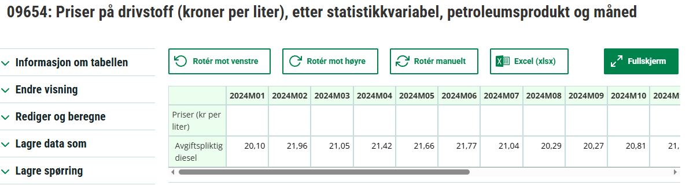
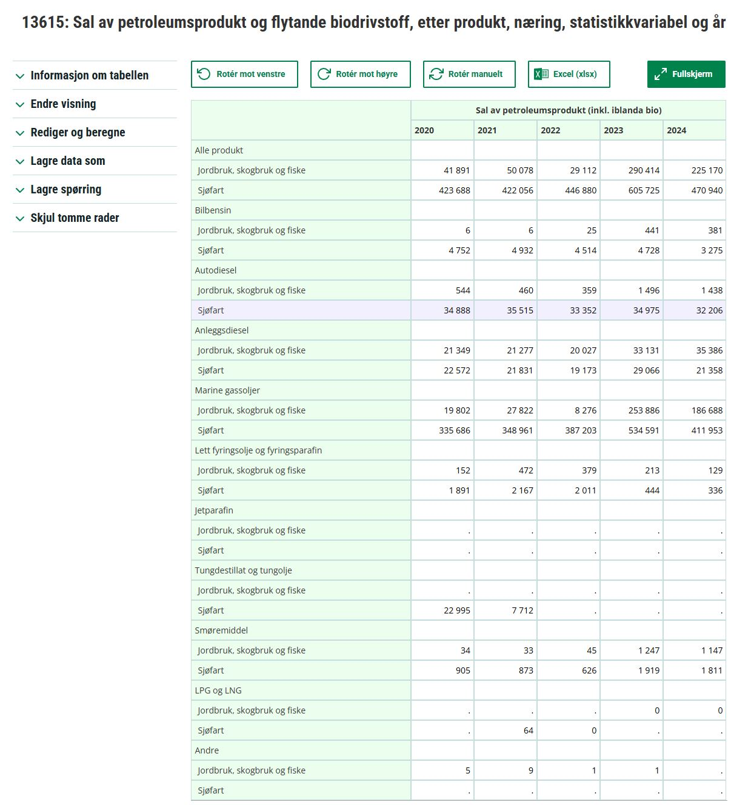

# SSB Prisstatistikk per måned for gjennomsnittlig månedspris autodiesel

Se [Tabell avgiftspliktig diesel](https://www.ssb.no/statbank/table/09654/tableViewLayout1/) 
for snittpris per måned for autodiesel; ikke marine gassoljer/bunkers.



Fila '09654_20250909-091411.xls' har data fra denne tabellen for 1986M08-2025M07. 

## API-kall
URL: https://data.ssb.no/api/v0/no/table/09654/

JSON-query(json-stat2) for 2024-2025:

```
{
  "query": [
    {
      "code": "PetroleumProd",
      "selection": {
        "filter": "item",
        "values": [
          "035"
        ]
      }
    },
    {
      "code": "Tid",
      "selection": {
        "filter": "item",
        "values": [
          "2024M01",
          "2024M02",
          "2024M03",
          "2024M04",
          "2024M05",
          "2024M06",
          "2024M07",
          "2024M08",
          "2024M09",
          "2024M10",
          "2024M11",
          "2024M12",
          "2025M01",
          "2025M02",
          "2025M03",
          "2025M04",
          "2025M05",
          "2025M06",
          "2025M07"
        ]
      }
    }
  ],
  "response": {
    "format": "json-stat2"
  }
}
```


PxWebApi 2.0 beta (for 2024-25): https://data.ssb.no/api/pxwebapi/v2-beta/tables/09654/data?lang=no&valueCodes[PetroleumProd]=035&valueCodes[Tid]=2024M01,2024M02,2024M03,2024M04,2024M05,2024M06,2024M07,2024M08,2024M09,2024M10,2024M11,2024M12,2025M01,2025M02,2025M03,2025M04,2025M05,2025M06,2025M07&valueCodes[ContentsCode]=Priser

<details>
  <summary>Click to expand PxWebApi response (json-stat2):</summary>

```
{
  "version": "2.0",
  "class": "dataset",
  "label": "09654: Priser på drivstoff (kroner per liter), etter petroleumsprodukt og måned",
  "source": "Statistisk sentralbyrå",
  "updated": "2025-08-20T06:00:00Z",
  "role": {
    "time": [
      "Tid"
    ],
    "metric": [
      "ContentsCode"
    ]
  },
  "id": [
    "PetroleumProd",
    "ContentsCode",
    "Tid"
  ],
  "size": [1, 1, 19],
  "dimension": {
    "PetroleumProd": {
      "label": "petroleumsprodukt",
      "category": {
        "index": {
          "035": 0
        },
        "label": {
          "035": "Avgiftspliktig diesel"
        }
      },
      "extension": {
        "elimination": false,
        "show": "value"
      }
    },
    "ContentsCode": {
      "label": "statistikkvariabel",
      "category": {
        "index": {
          "Priser": 0
        },
        "label": {
          "Priser": "Priser (kr per liter)"
        },
        "unit": {
          "Priser": {
            "base": "kr per liter",
            "decimals": 2
          }
        }
      },
      "extension": {
        "elimination": false,
        "refperiod": {
          "Priser": "01.01.-31.12."
        },
        "show": "value",
        "measuringType": {
          "Priser": "Average"
        },
        "priceType": {
          "Priser": "NotApplicable"
        },
        "adjustment": {
          "Priser": "None"
        }
      }
    },
    "Tid": {
      "label": "måned",
      "category": {
        "index": {
          "2024M01": 0,
          "2024M02": 1,
          "2024M03": 2,
          "2024M04": 3,
          "2024M05": 4,
          "2024M06": 5,
          "2024M07": 6,
          "2024M08": 7,
          "2024M09": 8,
          "2024M10": 9,
          "2024M11": 10,
          "2024M12": 11,
          "2025M01": 12,
          "2025M02": 13,
          "2025M03": 14,
          "2025M04": 15,
          "2025M05": 16,
          "2025M06": 17,
          "2025M07": 18
        },
        "label": {
          "2024M01": "2024M01",
          "2024M02": "2024M02",
          "2024M03": "2024M03",
          "2024M04": "2024M04",
          "2024M05": "2024M05",
          "2024M06": "2024M06",
          "2024M07": "2024M07",
          "2024M08": "2024M08",
          "2024M09": "2024M09",
          "2024M10": "2024M10",
          "2024M11": "2024M11",
          "2024M12": "2024M12",
          "2025M01": "2025M01",
          "2025M02": "2025M02",
          "2025M03": "2025M03",
          "2025M04": "2025M04",
          "2025M05": "2025M05",
          "2025M06": "2025M06",
          "2025M07": "2025M07"
        }
      },
      "extension": {
        "elimination": false,
        "show": "code"
      }
    }
  },
  "extension": {
    "px": {
      "infofile": "None",
      "tableid": "09654",
      "decimals": 2,
      "official-statistics": true,
      "aggregallowed": false,
      "copyright": false,
      "language": "no",
      "contents": "09654: Priser på drivstoff (kroner per liter),",
      "descriptiondefault": false,
      "heading": [
        "ContentsCode",
        "Tid"
      ],
      "stub": [
        "PetroleumProd"
      ],
      "matrix": "Priser",
      "subject-code": "ei",
      "subject-area": "Energi og industri"
    },
    "discontinued": null,
    "contact": [
      {
        "name": "Sigrun Kristoffersen",
        "organization": "Statistisk sentralbyrå",
        "phone": "409 02 313",
        "mail": "sek@ssb.no",
        "raw": "Sigrun Kristoffersen, Statistisk sentralbyrå# +47 409 02 313#sek@ssb.no"
      },
      {
        "name": "Ingunn Marie Verne Ruud",
        "organization": "Statistisk sentralbyrå",
        "phone": "489 96 563",
        "mail": "iev@ssb.no",
        "raw": "Ingunn Marie Verne Ruud, Statistisk sentralbyrå# +47 489 96 563#iev@ssb.no"
      }
    ]
  },
  "value": [20.1, 21.96, 21.05, 21.42, 21.66, 21.77, 21.04, 20.29, 20.27, 20.81, 21.15, 20.99, 21.43, 21.07, 20.43, 19.06, 19.17, 18.74, 20.69]
}
```
</details>

# Omsetningstall for petroleumsprodukter
Se [Sal av pretroleumsprodukt og flytande biodrivstoff](https://www.ssb.no/statbank/table/13615/tableViewLayout1/) 
for snittpris per måned for autodiesel; ikke marine gassoljer/bunkers.



## API kall

URL: https://data.ssb.no/api/v0/no/table/13615/
JSON-query:
```
{
  "query": [
    {
      "code": "Produkter",
      "selection": {
        "filter": "item",
        "values": [
          "01",
          "02a",
          "02b",
          "03",
          "04+05",
          "06",
          "07",
          "08",
          "09",
          "98"
        ]
      }
    },
    {
      "code": "NACE",
      "selection": {
        "filter": "item",
        "values": [
        "01-03",
          "50"
        ]
      }
    },
    {
      "code": "ContentsCode",
      "selection": {
        "filter": "item",
        "values": [
          "Petroleum"
        ]
      }
    }
  ],
  "response": {
    "format": "json-stat2"
  }
}
```

PxWebApi 2.0 beta (for 2020-24, Jorbruk, skogbruk, fiske samt sjøfart): https://data.ssb.no/api/pxwebapi/v2-beta/tables/13615/data?lang=no&valueCodes[Produkter]=01,02a,02b,03,04%2b05,06,07,08,09,98&valueCodes[NACE]=01-03,50&valueCodes[ContentsCode]=Petroleum&valueCodes[Tid]=2020,2021,2022,2023,2024


<details>
  <summary>Click to expand PxWebApi response (json-stat2):</summary>

```
{
  "version": "2.0",
  "class": "dataset",
  "label": "13615: Sal av petroleumsprodukt og flytande biodrivstoff, etter produkt, næring og år",
  "source": "Statistisk sentralbyrå",
  "updated": "2025-04-11T06:00:00Z",
  "note": [
    "Tal for produkta bensin, autodiesel, anleggsdiesel, marine gassoljer, lett fyringsolje og fyringsparafin for åra 2022-2024 vart retta 11.april 2025.",
    ". = Ikke mulig å oppgi tall. Tall finnes ikke på dette tidspunktet fordi kategorien ikke var i bruk da tallene ble samlet inn."
  ],
  "role": {
    "time": [
      "Tid"
    ],
    "metric": [
      "ContentsCode"
    ]
  },
  "id": [
    "Produkter",
    "NACE",
    "ContentsCode",
    "Tid"
  ],
  "size": [10, 2, 1, 5],
  "dimension": {
    "Produkter": {
      "label": "produkt",
      "category": {
        "index": {
          "01": 0,
          "02a": 1,
          "02b": 2,
          "03": 3,
          "04+05": 4,
          "06": 5,
          "07": 6,
          "08": 7,
          "09": 8,
          "98": 9
        },
        "label": {
          "01": "Bilbensin",
          "02a": "Autodiesel",
          "02b": "Anleggsdiesel",
          "03": "Marine gassoljer",
          "04+05": "Lett fyringsolje og fyringsparafin",
          "06": "Jetparafin",
          "07": "Tungdestillat og tungolje",
          "08": "Smøremiddel",
          "09": "LPG og LNG",
          "98": "Andre"
        }
      },
      "extension": {
        "elimination": false,
        "show": "value"
      },
      "link": {
        "describedby": [
          {
            "extension": {
              "Produkter": "urn:ssb:classification:klass:694"
            }
          }
        ]
      }
    },
    "NACE": {
      "label": "næring",
      "category": {
        "index": {
          "01-03": 0,
          "50": 1
        },
        "label": {
          "01-03": "Jordbruk, skogbruk og fiske",
          "50": "Sjøfart"
        }
      },
      "extension": {
        "elimination": false,
        "show": "value"
      },
      "link": {
        "describedby": [
          {
            "extension": {
              "NACE": "urn:ssb:classification:klass:6"
            }
          }
        ]
      }
    },
    "ContentsCode": {
      "label": "statistikkvariabel",
      "category": {
        "index": {
          "Petroleum": 0
        },
        "label": {
          "Petroleum": "Sal av petroleumsprodukt (inkl. iblanda bio)"
        },
        "unit": {
          "Petroleum": {
            "base": "1 000 liter",
            "decimals": 0
          }
        }
      },
      "extension": {
        "elimination": false,
        "refperiod": {
          "Petroleum": "Slutten av året"
        },
        "show": "value",
        "measuringType": {
          "Petroleum": "Flow"
        },
        "priceType": {
          "Petroleum": "NotApplicable"
        },
        "adjustment": {
          "Petroleum": "None"
        }
      }
    },
    "Tid": {
      "label": "år",
      "category": {
        "index": {
          "2020": 0,
          "2021": 1,
          "2022": 2,
          "2023": 3,
          "2024": 4
        },
        "label": {
          "2020": "2020",
          "2021": "2021",
          "2022": "2022",
          "2023": "2023",
          "2024": "2024"
        }
      },
      "extension": {
        "elimination": false,
        "show": "code"
      }
    }
  },
  "extension": {
    "px": {
      "infofile": "None",
      "tableid": "13615",
      "decimals": 0,
      "official-statistics": true,
      "aggregallowed": true,
      "copyright": false,
      "language": "no",
      "contents": "13615: Sal av petroleumsprodukt og flytande biodrivstoff,",
      "descriptiondefault": false,
      "heading": [
        "ContentsCode",
        "Tid"
      ],
      "stub": [
        "Produkter",
        "NACE"
      ],
      "matrix": "Petroleum",
      "subject-code": "ei",
      "subject-area": "Energi og industri"
    },
    "discontinued": null,
    "contact": [
      {
        "name": "Ingunn Marie Verne Ruud",
        "organization": "Statistisk sentralbyrå",
        "phone": "489 96 563",
        "mail": "iev@ssb.no",
        "raw": "Ingunn Marie Verne Ruud, Statistisk sentralbyrå# +47 489 96 563#iev@ssb.no"
      },
      {
        "name": "Sigrun Kristoffersen",
        "organization": "Statistisk sentralbyrå",
        "phone": "409 02 313",
        "mail": "sek@ssb.no",
        "raw": "Sigrun Kristoffersen, Statistisk sentralbyrå# +47 409 02 313#sek@ssb.no"
      }
    ]
  },
  "value": [6, 6, 25, 441, 381, 4752, 4932, 4514, 4728, 3275, 544, 460, 359, 1496, 1438, 34888, 35515, 33352, 34975, 32206, 21349, 21277, 20027, 33131, 35386, 22572, 21831, 19173, 29066, 21358, 19802, 27822, 8276, 253886, 186688, 335686, 348961, 387203, 534591, 411953, 152, 472, 379, 213, 129, 1891, 2167, 2011, 444, 336, null, null, null, null, null, null, null, null, null, null, null, null, null, null, null, 22995, 7712, null, null, null, 34, 33, 45, 1247, 1147, 905, 873, 626, 1919, 1811, null, null, null, 0, 0, null, 64, 0, null, null, 5, 9, 1, 1, null, null, null, null, null, null],
  "status": {
    "50": ".",
    "51": ".",
    "52": ".",
    "53": ".",
    "54": ".",
    "55": ".",
    "56": ".",
    "57": ".",
    "58": ".",
    "59": ".",
    "60": ".",
    "61": ".",
    "62": ".",
    "63": ".",
    "64": ".",
    "67": ".",
    "68": ".",
    "69": ".",
    "80": ".",
    "81": ".",
    "82": ".",
    "85": ".",
    "88": ".",
    "89": ".",
    "94": ".",
    "95": ".",
    "96": ".",
    "97": ".",
    "98": ".",
    "99": "."
  }
}
```
</details>